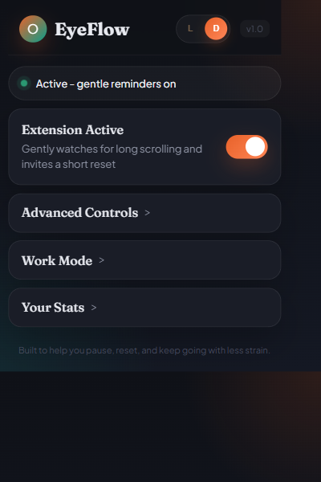
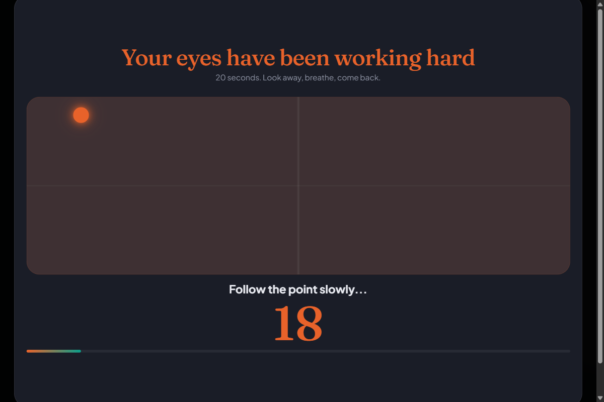
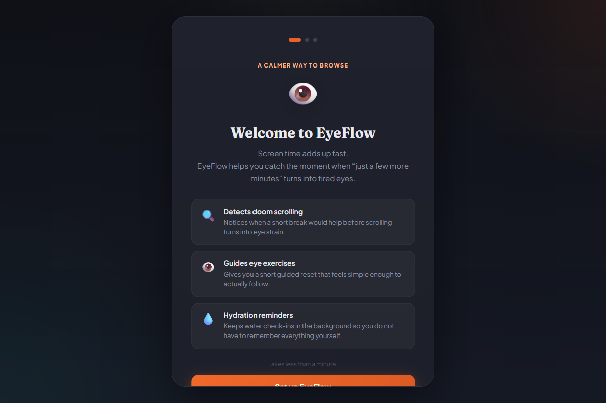

<div align="center">

# 👁️ EyeFlow

### A Chrome Extension That Fights Doom Scrolling — And Looks After Your Eyes

[](https://github.com/kumaraharsh84/eye_flow_chrome_extension)
[](https://developer.chrome.com/docs/extensions/mv3/)
[](LICENSE)
[](https://github.com/kumaraharsh84/eye_flow_chrome_extension)

<br/>

> You open Instagram for 5 minutes. Two hours later, your eyes hurt and you forgot to drink water.
> EyeFlow watches for that loop — and quietly breaks it.

<br/>

---

</div>

## What Is This?

EyeFlow is a Chrome extension that detects doom scrolling on high-risk sites like **Instagram Reels, YouTube Shorts, Reddit, Facebook, and X** — and responds with:

- **Guided eye-break exercises** — a moving dot you follow with your eyes, proven to reduce screen strain
- **Gentle reminders** during normal browsing, when you have been staring at a screen too long
- **Hydration nudges** because we all forget to drink water when we are deep in a scroll loop

The core workflow is strict and universal: it helps **you** stay focused and healthy while working, but it can also be used to **monitor and manage a younger sibling's** screen time perfectly.

---

## Screenshots

> Add your screenshots to `docs/screenshots/` folder and update the links below

| Popup                                | Eye Break Overlay                        | Onboarding                                     |
| ------------------------------------ | ---------------------------------------- | ---------------------------------------------- |
|  |  |  |

---

## Features

### Core

| Feature                         | Description                                                                               |
| ------------------------------- | ----------------------------------------------------------------------------------------- |
| 🔍 Doom-scroll detection        | Detects high-risk scrolling on Instagram, YouTube Shorts, Reddit, Facebook, X, and TikTok |
| 👁️ Fullscreen eye-break overlay | Guided 6-step exercise with moving dot, countdown, and progress bar                       |
| 💧 Hydration reminder           | Global water reminder every 2 hours                                                       |
| 😌 Post-break recovery          | Mood logging, time-on-site alert, and next-step suggestions after every break             |
| 🔔 Gentle reminder              | Soft corner reminder during normal non-DS browsing                                        |

### Monitoring & Syncing

| Feature                 | Description                                                                                   |
| ----------------------- | --------------------------------------------------------------------------------------------- |
| 🕵️ Incognito Mode Sync  | Tracks doom scrolling seamlessly even if the user opens an Incognito window                   |
| 📧 Weekly Email Reports | Automatically emails a weekly breakdown of time spent per site and interruptions via Webhooks |

### Smart Behavior

| Feature                    | Description                                                                      |
| -------------------------- | -------------------------------------------------------------------------------- |
| 🎯 Context-aware detection | Instagram DMs, login pages, payment flows, typing — all suppressed automatically |
| 📺 Passive video detection | Watching a long YouTube video without scrolling? Extension stays quiet           |
| 🔄 Tab sync                | DS timer is shared across all open doom-scroll tabs                              |
| 😴 Idle detection          | Walk away from your laptop — timers pause automatically                          |
| ⏸️ Work mode snooze        | Pause gentle reminders for 1h, 2h, or 4h without disabling DS protection         |

### User Control

| Feature               | Description                                                        |
| --------------------- | ------------------------------------------------------------------ |
| ⚙️ Popup settings     | Sensitivity, timing, snooze, theme, suggestions — all configurable |
| 🎨 Dark / Light theme | Popup supports both themes                                         |
| 📊 Stats dashboard    | Blocked sessions, breaks taken, weekly history, mood trends        |
| 🧭 Onboarding         | 3 preset modes on first install — Strict, Balanced, or Gentle      |

---

## 👨‍👩‍👧‍👦 How to Setup Sibling Monitoring

EyeFlow is an excellent tool for keeping track of how much time a sibling spends doom scrolling.

### Step 1: Enable Incognito Tracking

By default, Chrome extensions are disabled in Incognito mode. To prevent your sibling from hiding their usage:

1. Open the EyeFlow popup.
2. If Incognito is disabled, you will see a prominent **❌ Incognito Tracking** warning.
3. Click the **Enable** button to open Chrome's extension settings.
4. Toggle **Allow in Incognito** to ON.
   Now, the tracking and eye-breaks will function seamlessly across both regular and Incognito tabs!

### Step 2: Setup Weekly Email Reports

EyeFlow can email you a weekly report containing the total minutes spent on each site. Because extensions cannot send emails directly, it uses a free Webhook service:

1. Create a free account at [Formspree](https://formspree.io/) or [Make.com](https://make.com).
2. Create a form/webhook and copy the unique URL.
3. Open the EyeFlow popup and expand **Advanced Controls**.
4. Paste the URL into the **Weekly Email Report** box.
5. Click **Send Test Report** to verify it works.
   Every Monday at midnight, you will receive a silent email report with their statistics!

---

## How It Works

```
You open Instagram
    ↓
EyeFlow detects you are on a doom-scroll surface
    ↓
You start scrolling rapidly
    ↓
Stage 1 → Small nudge appears at the corner
          "Still here?"
    ↓
You ignore it
    ↓
Stage 2 → Warning banner appears
          "30 seconds — that's all"
    ↓
You ignore that too
    ↓
Stage 3 → Fullscreen eye-break overlay
          Guided 6-step exercise with moving dot
    ↓
Break complete → Mood check → Next-step suggestion
    ↓
Timer resets — cycle begins again
```

---

## Supported Sites

| Site            | Strong DS surfaces   | Gentle only                   | Suppressed                |
| --------------- | -------------------- | ----------------------------- | ------------------------- |
| **Instagram**   | Home, Explore, Reels | Direct messages, single posts | Live streams, video calls |
| **YouTube**     | Shorts               | Long-form videos              | Live chat                 |
| **Reddit**      | Home, Popular, feeds | Single post + comments        | Notifications, settings   |
| **X / Twitter** | Home, Explore        | Single tweet, notifications   | Direct messages           |
| **Facebook**    | Home, Watch, Groups  | —                             | Messenger                 |
| **TikTok**      | Everything           | —                             | Direct messages           |

---

## Onboarding Modes

| Mode            | What It Does                                             |
| --------------- | -------------------------------------------------------- |
| 🔒 **Strict**   | Higher sensitivity, faster reminders, no skip button     |
| ⚖️ **Balanced** | Recommended — nudge first, then warning, then full break |
| 🌿 **Gentle**   | Lower sensitivity, fewer interruptions                   |

---

## Project Structure

```
eyeflow-chrome-extension/
│
├── src/                    ← Source code files
│   ├── manifest.json       ← Chrome extension config (MV3)
│   ├── background.js       ← Global scheduler, timers, storage, alarms
│   ├── content.js          ← Page detection, per-tab behavior
│   ├── overlay.js          ← Fullscreen eye-break and post-break UI
│   ├── intelligence.js     ← Detection heuristics
│   ├── popup.js            ← Popup logic
│   └── ...                 ← HTML/CSS files
│
├── dist/                   ← Bundled output files (Load this in Chrome)
│
├── build.js                ← ESBuild bundling script
├── eslint.config.js        ← ESLint v9 Flat Config
└── package.json            ← Dependencies and NPM scripts
```

---

## Install Locally (Developer Mode)

The project uses ES Modules and `esbuild` for bundling. You must build the project before loading it into Chrome!

```bash
# 1. Clone the repo
git clone https://github.com/kumaraharsh84/eye_flow_chrome_extension.git

# 2. Install dependencies
npm install

# 3. Build the extension into the /dist folder
npm run build

# 4. Open Chrome and go to
chrome://extensions/

# 5. Turn on Developer Mode (top right toggle)

# 6. Click "Load unpacked"

# 7. Select the `dist/` folder inside the cloned repository!

# 8. Pin the EyeFlow icon to your toolbar
```

---

## Testing

### Automated Tests

```bash
# Run unit tests and puppeteer smoke tests
npm test

# Run full E2E suite
npm run test:e2e

# Test specific flows
npm run test:onboarding
npm run test:popup
```

---

## Current Status

```
✅ Extension runtime         working
✅ Popup and onboarding      working
✅ Shared timer logic        working
✅ Fullscreen overlay flow   working
✅ Automated test coverage   working
✅ ESLint warnings fixed     working
✅ Incognito mode sync       working
✅ Webhook Email Reports     working
```

---

## Privacy

EyeFlow does not collect, transmit, or store any personal data on any server.

- All data lives in your browser's local storage only
- No accounts required
- No analytics or tracking
- Only weekly reports are transmitted to the webhook URL explicitly provided by you
- No data ever leaves your device otherwise

---

## License

MIT — use it, fork it, change it, share it.

---

<div align="center">

Built to help you pause, reset, and keep going with less strain. 👁️💧

</div>
